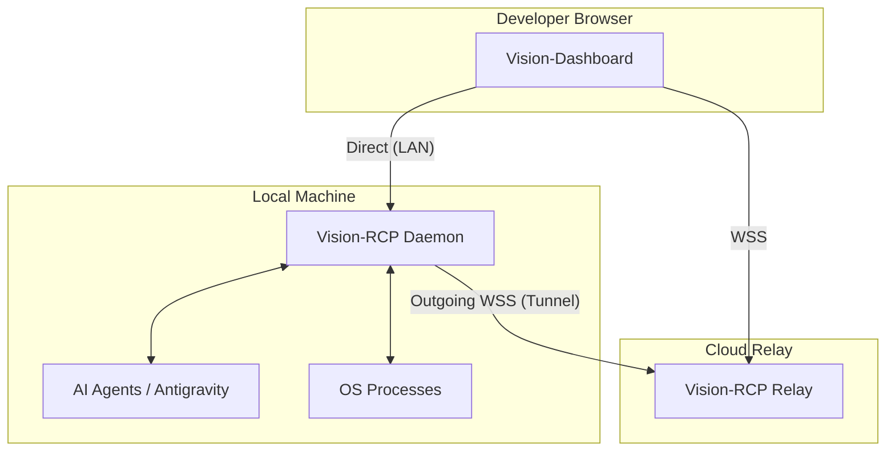

# ⬡ Vision-RCP
### The Remote Control Plane for Autonomous AI Agents


[](https://opensource.org/licenses/MIT)
[](https://www.python.org/downloads/)
[](https://reactjs.org/)
[](https://vitejs.dev/)

**Vision-RCP** is a high-performance orchestration framework designed to solve "Agent Blindness." It provides a secure, web-based control plane for monitoring, auditing, and directing autonomous AI agents running on local machines.

---

## ⚡ The Vision
Local AI agents (like Antigravity) are becoming powerful, but they operate in a "black box." Developers often struggle to:
- **Monitor** real-time process logs without ssh-ing into every machine.
- **Interact** with agents via a unified chat interface.
- **Audit** the RCP (Remote Control Plane) traffic to ensure safety.
- **Bridge** local OS controls to remote web-dashboards securely.

**Vision-RCP** provides the **Eyes** (Process Streaming), the **Voice** (Chat Adapter), and the **Nervous System** (Zero-Config Relay Bridge) for your local agent fleet.

---

## 🏗️ System Architecture

Vision-RCP uses a decoupled 3-tier architecture to ensure maximum performance and zero-config remote access.



---

## 🚀 Key Features

- **🛡️ Zero-Trust Security**: Every command is authenticated via HMAC-SHA256 JWTs with automatic rotation. No open inbound ports required.
- **🐚 High-Fidelity Streaming**: Real-time `stdout/stderr` multiplexing via xterm.js with sub-50ms latency.
- **🔍 Flow Audit**: Built-in traffic sniffer to inspect raw RCP packets, ensuring your agents are behaving exactly as expected.
- **🔗 Intelligent Tunneling**: Outbound-only WebSocket relay allows you to access your dashboard from anywhere without port forwarding.
- **📐 Dependency-Aware DAG**: A topological process engine that ensures services start and stop in the correct dependency order.

---

## 🗺️ Agent Roster (Adapters)

| Agent Name | Role | Interface | Description |
|:---|:---|:---|:---|
| **Antigravity Chat** | Reasoning | `AntigravityAdapter` | Orchestration agent that accepts natural language commands. |
| **Terminal Bridge** | Execution | `SubprocessAdapter` | Low-level bridge for running shell commands and returning logs. |
| **Process Monitor** | Observation| `psutil` | Real-time CPU/Memory hardware metrics provider. |

---

## 🛠️ Quick Start

### 1. Prerequisites
- **Python 3.11+**
- **Node.js 18+**
- **Windows** (for `pywinauto` desktop automation features)

### 2. Installation & Launch
Clone the repository and run the one-click local setup:

```powershell
# Clone and enter
git clone https://github.com/your-org/vision-rcp.git
cd vision-rcp

# Launch everything (Installs deps automatically)
.\start-app.bat
```

### 3. Connect
Open the generated link in your browser:
`http://localhost:5173/?k=[YOUR_SECRET_KEY]`

---

## 📂 Project Structure

```text
Vision-RCP/
├── daemon/         # Python Engine (FastAPI + psutil + JWT)
├── relay/          # WebSocket Bridge (No-config tunneling)
├── ui/             # React Dashboard (Zustand + xterm.js)
├── protocol/       # JSON-Schema RCP Protocol definitions
└── learning.md     # Engineering journal & breakthroughs
```

---

## 🛣️ Roadmap

- [ ] **Multi-Host Clustering**: Manage a fleet of 100+ daemons from one dashboard.
- [ ] **Mobile Control App**: Native iOS/Android clients for on-the-go agent monitoring.
- [ ] **Plugin SDK**: Build your own adapters for specific AI models or hardware.
- [ ] **Autonomous Recovery**: AI-driven self-healing for crashed daemon processes.

---

## 🤝 Contributing

We welcome contributions! Please see our [Contributing Guide](CONTRIBUTING.md) for details on how to get involved.

> [!IMPORTANT]
> **Security First**: Never commit `.env` files or secret keys. Our pre-commit hooks will automatically scan for credentials.

---

## ⚖️ License & Disclaimer

**License**: Distributed under the [MIT License](LICENSE).

**Disclaimer**: 
> [!CAUTION]
> Vision-RCP grants remote control privileges to your local system. Ensure you use strong secret keys and run the relay server on trusted infrastructure.

---

## 🌍 Cloud & Mobile Readiness

Vision-RCP is designed for the modern developer who needs access to their agents from anywhere.
- **Mobile Handshake**: Scan the auto-generated **QR Code** in your terminal to instantly sync your phone with your local agent.
- **Vercel Enabled**: Deploy the dashboard to Vercel and control your local machine via a high-performance cloud relay.
- **Secure Tunneling**: Compatible with **Cloudflare Tunnel** for safe exposure without port forwarding.

Check the **[Deployment Guide](DEPLOYMENT.md)** for step-by-step instructions.

---
*© 2026 Vision-RCP Team — Built for the Agentic Future.*

