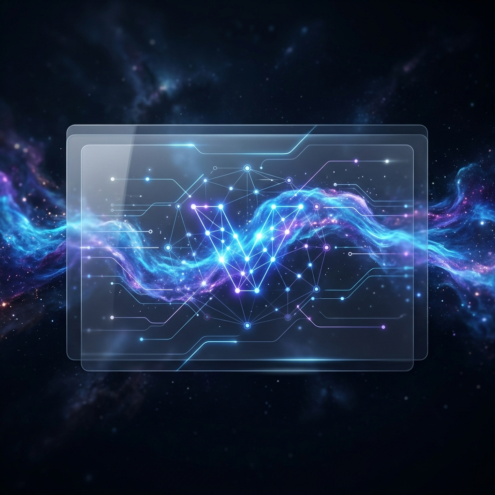
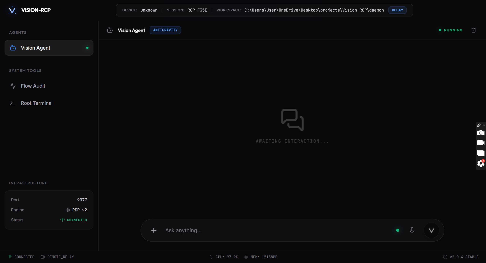

<div align="center">
  

  # 🌌 Vision-RCP
  ### The Remote Control Plane & Sentinel Watchdog for AI Agents

  [](https://opensource.org/licenses/MIT)
  [](https://www.microsoft.com/windows)
  []()

  **Mirror. Monitor. Mutate.**
  Vision-RCP is the high-performance orchestration layer that bridges the gap between local AI agents and remote mobility.

  [**Get Started**](#-quick-start) • [**Features**](#-core-capabilities) • [**Architecture**](#-the-triple-stream-stack)
</div>

---

## 🏗️ What is Vision-RCP?

Vision-RCP (Remote Control Plane) is a non-intrusive observation and orchestration layer designed for the next generation of AI agents. 

Current AI agents (like Antigravity or VS-Code Copilot) are powerful but "session-locked." Vision-RCP breaks those chains by mirroring the agent's internal state, logs, and GUI permissions to a secure, web-accessible dashboard—allowing you to control your machine's AI from a mobile browser with **sub-50ms latency**.

<p align="center">
  
</p>

---

## 🛡️ Core Capabilities

*   **🦾 Sentinel Agent (Autonomous Watchdog)**: A background orchestration layer that handles "Run Command" permissions. It auto-approves safe operations while enforcing hard guardrails for destructive commands, allowing for semi-autonomous remote tasking.
*   **💎 Triple-Guard Stabilization**: A definitive solution to message duplication. By combining **Subset Filtering**, **Identity Checks**, and **UID-based Rejection**, we deliver a crystal-clear, single-response experience even on high-latency mobile networks.
*   **🔗 Shadow-Link Tunneling**: Access your local dashboard from anywhere in the world without opening ports. Our outbound-only WSS relay provides a secure, encrypted bridge to your machine.
*   **🔍 Flow Audit**: A real-time traffic sniffer for inspecting raw RCP packets, providing deep transparency into your agent's communication pipeline.

---

## 🧬 The Triple-Stream Stack

Vision-RCP operates on three distinct layers to ensure a native-like remote experience:

1.  **The Eyes (Ingestion)**: Kernel-level pipe-cloning and a "Universal Vacuum" scraper that reconstructs fragmented UI text into semantic messages.
2.  **The Voice (Command Layer)**: Secure, bi-directional authenticated communication using HMAC-SHA256 tokens.
3.  **The Nervous System (Transport)**: A sub-50ms binary transport layer optimized for visual stability and real-time responsiveness.

---

## 🚀 Quick Start

### 1. Requirements
*   **OS**: Windows 10/11 (Required for RPA/pywinauto hooks)
*   **Engine**: Python 3.10+ & Node.js 18+

### 2. Installation & Pairing
Clone and launch the remote orchestrator in one command:
```powershell
git clone https://github.com/Subhamcode16/VISION-RCP.git; cd VISION-RCP; .\start-remote.bat
```

### 3. Pairing
1.  A **pairing QR code** will appear in your terminal.
2.  Scan it with your mobile device.
3.  You are now in full control of your local workstation from anywhere in the world.

---

## 📜 Security & License

Vision-RCP is built with a **Security-First** philosophy. All remote commands require HMAC-SHA256 authentication, and the Sentinel Agent serves as a final human-in-the-loop fallback for destructive operations.

Distributed under the **MIT License**. See `LICENSE` for more information.

---
<div align="center">
  <sub>Built with ❤️ by the Vision-RCP Team.</sub>
</div>
